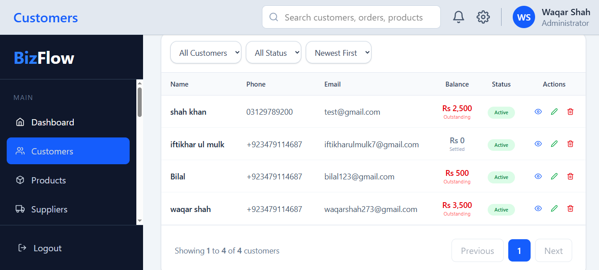

# BizFlow

A business inventory and accounting web app for small shops and distributors. BizFlow records purchases and sales, keeps stock up to date automatically, tracks payments and expenses, and turns the data into reports.

## Features

**Inventory**
- Products with automatic stock updates: stock goes up on a purchase and down on a sale
- Stock is also corrected when a purchase or order is edited or deleted
- Sales are blocked for products that have no stock

**Purchases and sales**
- Purchases (goods receiving) with supplier, line items, discount %, amount paid, and balance
- Sales orders with customer, line items, discount %, and grand total
- Auto-generated sequential invoice numbers (PUR001, PUR002, ...)
- Customers and suppliers management

**Payments and expenses**
- Received payments (from customers) and made payments (to suppliers)
- A payment can settle a specific order or purchase, or be recorded against a customer or supplier
- Each payment stores amount, date, method, and a reference note
- Expense records

**Reports**
- **Profit & Loss:** revenue, cost of goods sold, expenses, and net profit for any date range
- **Customer balances:** who owes you money
- **Supplier balances:** what you owe each supplier
- **Stock:** quantity and value per product, with low-stock and out-of-stock flags
- **Sales:** orders by date, customer, and product
- **Purchases:** purchases by date, supplier, and product
- Date range filters, search, and CSV export on the reports



## Why shop owners will like it

- **Always know your numbers.** Cash in hand, bank balance, monthly sales and expenses are on the first screen.
- **Stock updates itself.** Buy goods and stock goes up. Make a sale and it goes down. No manual counting.
- **Know who owes you, and who you owe.** Every customer and supplier has a live balance.
- **See your real profit.** Revenue, cost of goods and expenses combine into a clear profit and loss report.
- **Easy to use.** Clean screens, quick forms, and nothing you don't need.

## What you can do

### Sell and track customers
Create orders, apply discounts, and record payments. Each order shows what was paid, what is still owed, and its status (Paid or Partial).


Keep a customer list with phone, email and outstanding balance, so you know who to follow up with.


### Buy and receive goods
Record purchases from suppliers with invoice numbers like PUR001, discounts, and payments made. Stock is added automatically.


### Manage your money
Keep your cash and bank accounts in one place and watch their balances change as you sell, buy and spend.


Record shop expenses like rent and salaries, and choose which account paid for them.


### Understand your business with reports
- **Profit & Loss:** revenue, cost of goods, expenses and net profit for any period
- **Customer balances:** who owes you money
- **Supplier balances:** what you owe
- **Stock:** quantity and value for each product, with low-stock and out-of-stock warnings
- **Sales and Purchases:** by date, customer or supplier, and product
- Filter by date, search, and **export to CSV** for Excel


## Built with

React · Vite · Tailwind CSS · Firebase Firestore · React Router · react-hook-form

## Run it yourself

You need Node.js 18+ and a free Firebase project.

```bash
git clone https://github.com/waqaronline614-code/bizflow.git
cd bizflow
npm install
```

1. Create a project in the [Firebase console](https://console.firebase.google.com/) and turn on **Firestore Database**.
2. Add your Firebase settings in `src/firebase/firebase.js`.
3. Start the app:

```bash
npm run dev
```

> Keep your Firebase keys private. Don't commit real secrets to GitHub.

## How the data is organized

| Collection | What it stores |
|---|---|
| `products` | Items you sell and their current stock |
| `customers` | Your customers |
| `supplier` | Your suppliers |
| `orders` | Sales with line items |
| `purchases` | Purchases with line items |
| `payments` | Money received and money paid |
| `expenses` | Shop expenses |

## What's coming next

- [ ] Expenses report (spending by category and date)
- [ ] Cash and bank report (money in vs. out per account)
- [ ] Printable invoices
- [ ] Purchase return 
- [ ] Order return 

## Need something like this?

I'm **Syed Waqar Ahmed Shah**, a frontend developer who builds React and Firebase apps for businesses. If you'd like a custom system for your shop or company, get in touch.

- GitHub: [@waqaronline614-code](https://github.com/waqaronline614-code)
- Email: waqarshsh272@gamil.com
- WhatsApp: 0313-9178906